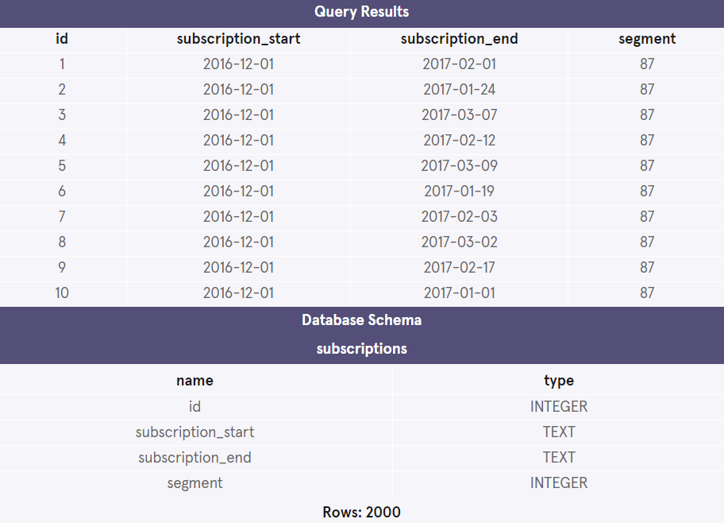
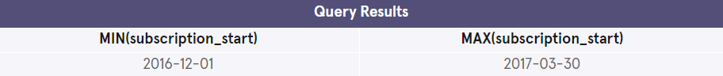
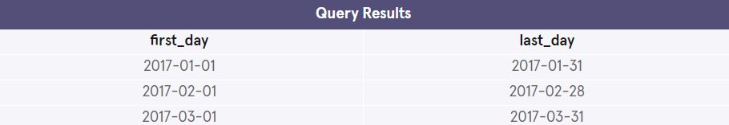

## Calculating Churn Rates

Four months into launching Codeflix, management asks you to look into subscription churn rates. It’s early on in the business and people are excited to know how the company is doing.

The marketing department is particularly interested in how the churn compares between two segments of users. They provide you with a dataset containing subscription data for users who were acquired through two distinct channels.

The dataset provided to you contains one SQL table, subscriptions. Within the table, there are 4 columns:
- id - the subscription id
- subscription_start - the start date of the subscription
- subscription_end - the end date of the subscription
- segment - this identifies which segment the subscription owner belongs to

Codeflix requires a minimum subscription length of 31 days, so a user can never start and end their subscription in the same month.

### Get familiar with the data


1. Take a look at the first 100 rows of data in the subscriptions table. How many different segments do you see?

```mysql
 SELECT *
 FROM subscriptions
 LIMIT 10;
 ```


2. Determine the range of months of data provided. Which months will you be able to calculate churn for?

```mysql
 SELECT MIN(subscription_start),
 MAX(subscription_start)
 FROM subscriptions;
```


### Calculate churn rate for each segment

3. You’ll be calculating the churn rate for both segments (87 and 30) over the first 3 months of 2017 (you can’t calculate it for December, since there are no subscription_end values yet). To get started, create a temporary table of months.

```mysql
WITH months AS (
  SELECT 
    '2017-01-01' AS first_day, 
    '2017-01-31' AS last_day 
  UNION 
  SELECT 
    '2017-02-01' AS first_day, 
    '2017-02-28' AS last_day 
  UNION 
  SELECT 
    '2017-03-01' AS first_day, 
    '2017-03-31' AS last_day
)
SELECT * FROM months;
```


