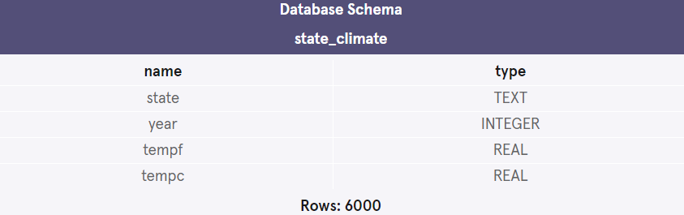
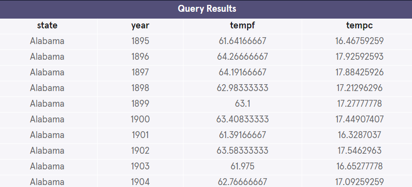
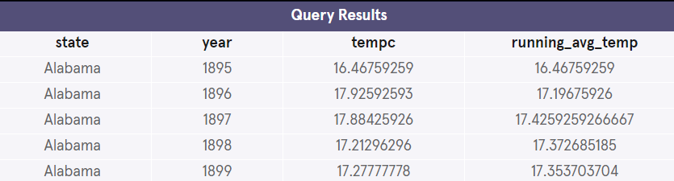

## Climate Change
To practice what you’ve learned about window functions, you are going to use climate data from each state in the United States. A labeled map of the United States can be found here.

These data will show the average annual temperature for each state – this is the average temperature of every day in all parts of the state for that year.

For this project, you will be working with one table:

- state_climate


### Understanding the Data
1. Let’s see what our table contains by running the following command:

```mysql
SELECT * 
FROM state_climate
LIMIT 10;
 ```


### Aggregate and Value Functions
2. Let’s start by looking at how the average temperature changes over time in each state.

Write a query that returns the state, year, tempf or tempc, and running_avg_temp (in either Celsius or Fahrenheit) for each state.

(The running_avg_temp should use a window function.)

```mysql
SELECT * 
FROM state_climate
LIMIT 10;
 ```



3. Now let’s explore the lowest temperatures for each state.

Write a query that returns state, year, tempf or tempc, and the lowest temperature (lowest_temp) for each state.

Are the lowest recorded temps for each state more recent or more historic?

```mysql
SELECT state,
  FIRST_VALUE(tempf) OVER (
      PARTITION BY state
      ORDER BY tempf
    ) running_avg_temp
FROM state_climate
GROUP BY state;
```


