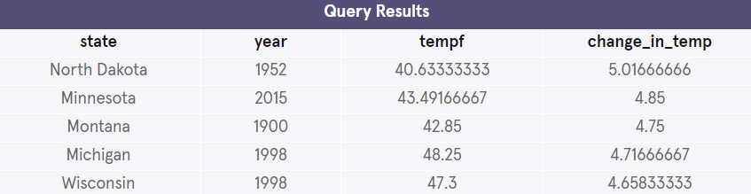

## Climate Change
To practice what you’ve learned about window functions, you are going to use climate data from each state in the United States. A labeled map of the United States can be found here.

These data will show the average annual temperature for each state – this is the average temperature of every day in all parts of the state for that year.

For this project, you will be working with one table:

- state_climate


### Understanding the Data
1. Let’s see what our table contains by running the following command:

```mysql
SELECT * 
FROM state_climate
LIMIT 10;
 ```


### Aggregate and Value Functions
2. Let’s start by looking at how the average temperature changes over time in each state.

Write a query that returns the state, year, tempf or tempc, and running_avg_temp (in either Celsius or Fahrenheit) for each state.

(The running_avg_temp should use a window function.)

```mysql
SELECT state, 
       year, 
       tempc, 
       AVG(tempc) OVER(
          ORDER BY state, year
       ) AS 'running_avg_temp'
FROM state_climate
LIMIT 5;
 ```


3. Now let’s explore the lowest temperatures for each state.

Write a query that returns state, year, tempf or tempc, and the lowest temperature (lowest_temp) for each state.

Are the lowest recorded temps for each state more recent or more historic?

```mysql
SELECT state,
       FIRST_VALUE(tempf) OVER (
          PARTITION BY state
          ORDER BY tempf
        ) lowest_temp
FROM state_climate
GROUP BY state
LIMIT 5;
```


4.Like before, write a query that returns state, year, tempf or tempc, except now we will also return the highest temperature (highest_temp) for each state.

Are the highest recorded temps for each state more recent or more historic?

```mysql
SELECT state,
       LAST_VALUE(tempf) OVER (
          PARTITION BY state
          ORDER BY tempf
          RANGE BETWEEN UNBOUNDED PRECEDING AND UNBOUNDED FOLLOWING
        ) highest_temp
FROM state_climate
GROUP BY state
LIMIT 5;
```


5. Let’s see how temperature has changed each year in each state.
 
Write a query to select the same columns but now you should write a window function that returns the change_in_temp from the previous year (no null values should be returned).

- Which states and years saw the largest changes in temperature?
- Is there a particular part of the United States that saw the largest yearly changes in temperature?

```mysql
SELECT
  state,
  year,
  tempf,
  tempf - lag(tempf,1,tempf) OVER (
    PARTITION BY state
    ORDER BY year 
  ) AS 'change_in_temp'
FROM state_climate
ORDER BY change_in_temp DESC
LIMIT 5;
```



6. Write a query to return a rank of the coldest temperatures on record (coldest_rank) along with year, state, and tempf or tempc. Are the coldest ranked years recent or historic? The coldest years should be from any state or year.

```mysql
SELECT 
  RANK() OVER (
    ORDER BY tempc
    ) AS 'coldest_rank',
  state, 
  year, 
  tempc
FROM state_climate
LIMIT 5;
```


7. Modify your coldest_rank query to now instead return the warmest_rank for each state, meaning your query should return the warmest temp/year for each state. Again, are the warmest temperatures more recent or historic for each state?

```mysql
SELECT 
  RANK() OVER (
    PARTITION BY state
    ORDER BY tempc DESC
    ) AS 'warmest_rank',
  state, 
  year, 
  tempc
FROM state_climate;
```


8. Let’s now write a query that will return the average yearly temperatures in quartiles instead of in rankings for each state.

Your query should return quartile, year, state and tempf or tempc. The top quartile should be the coldest years.

Are the coldest years more recent or historic?

```mysql
SELECT 
 NTILE(4) OVER (
     PARTITION BY state
   ORDER BY tempc
   ) AS 'quartile',
 state,
 year,
 tempc
FROM state_climate;
```


9. Lastly, we will write a query that will return the average yearly temperatures in quintiles (5).

Your query should return quintile, year, state and tempf or tempc. The top quintile should be the coldest years overall, not by state.

What is different about the coldest quintile now?

```mysql
SELECT 
 NTILE(5) OVER (
   ORDER BY tempc
   ) AS 'quintile',
 state,
 year,
 tempc
FROM state_climate;
```


