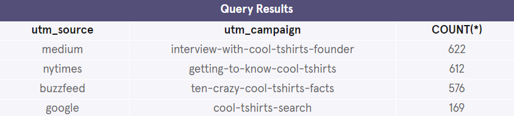
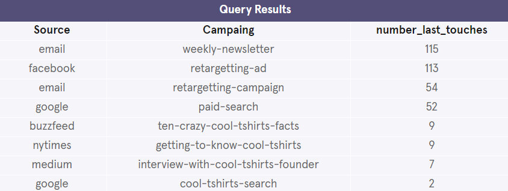

## Attribution Queries

CoolTShirts sells shirts of all kinds, as long as they are T-shaped and cool. Recently, CTS started a few marketing campaigns to increase website visits and purchases. Using touch attribution, they’d like to map their customers’ journey: from initial visit to purchase. They can use that information to optimize their marketing campaigns. This project will guide you through some of that process.


1. How many campaigns and sources does CoolTShirts use? Which source is used for each campaign?

Use three queries:

- one for the number of distinct campaigns,

```mysql
SELECT COUNT(DISTINCT (utm_campaign))
FROM page_visits
```


- one for the number of distinct sources,
```mysql
SELECT COUNT(DISTINCT (utm_source))
FROM page_visits;
```


- one to find how they are related.

```mysql
SELECT DISTINCT (utm_source),
utm_campaign
FROM page_visits;
```


2. What pages are on the CoolTShirts website?

Find the distinct values of the page_name column.

- one for the number of distinct sources,
```mysql
SELECT DISTINCT (page_name)
FROM page_visits;
```


3. How many first touches is each campaign responsible for?

You’ll need to use the first-touch query from the lesson (also provided in the hint below). Group by campaign and count the number of first touches for each.

```mysql
WITH first_touch AS (
    SELECT user_id,
        MIN(timestamp) as first_touch_at
    FROM page_visits
    GROUP BY user_id),
    ft_attr AS (
  SELECT ft.user_id,
         ft.first_touch_at,
         pv.utm_source,
         pv.utm_campaign
  FROM first_touch ft
  JOIN page_visits pv
    ON ft.user_id = pv.user_id
    AND ft.first_touch_at = pv.timestamp
)
SELECT ft_attr.utm_source as Source,
       ft_attr.utm_campaign as Campaing,
       COUNT(*) as number_first_touches
FROM ft_attr
GROUP BY 1, 2
ORDER BY 3 DESC;
```


4. How many last touches is each campaign responsible for?

```mysql
WITH last_touch AS (
    SELECT user_id,
        MAX(timestamp) as last_touch_at
    FROM page_visits
    GROUP BY user_id),
    lt_attr AS (
  SELECT lt.user_id,
         lt.last_touch_at,
         pv.utm_source,
         pv.utm_campaign
  FROM last_touch lt
  JOIN page_visits pv
    ON lt.user_id = pv.user_id
    AND lt.last_touch_at = pv.timestamp
)
SELECT lt_attr.utm_source as Source,
       lt_attr.utm_campaign as Campaing,
       COUNT(*) as number_last_touches
FROM lt_attr
GROUP BY 1, 2
ORDER BY 3 DESC;
```
```


5. How many visitors make a purchase?

Count the distinct users who visited the page named 4 - purchase.

```mysql
SELECT COUNT(*)
FROM page_visits
WHERE page_name = "4 - purchase";
```


6. How many last touches on the purchase page is each campaign responsible for?

```mysql
WITH last_touch AS (
    SELECT user_id,
        MAX(timestamp) as last_touch_at
    FROM page_visits
    WHERE page_name = '4 - purchase'
    GROUP BY user_id),
    lt_attr AS (
  SELECT lt.user_id,
         lt.last_touch_at,
         pv.utm_source,
         pv.utm_campaign
  FROM last_touch lt
  JOIN page_visits pv
    ON lt.user_id = pv.user_id
    AND lt.last_touch_at = pv.timestamp
)
SELECT lt_attr.utm_source as Source,
       lt_attr.utm_campaign as Campaing,
       COUNT(*) as number_last_touches
FROM lt_attr
GROUP BY 1, 2
ORDER BY 3 DESC;
```


7. CoolTShirts can re-invest in 5 campaigns. Given your findings in the project, which should they pick and why?
   
```mysql
WITH last_touch AS (
    SELECT user_id,
        MAX(timestamp) as last_touch_at
    FROM page_visits
    WHERE page_name = '4 - purchase'
    GROUP BY user_id),
    lt_attr AS (
  SELECT lt.user_id,
         lt.last_touch_at,
         pv.utm_source,
         pv.utm_campaign
  FROM last_touch lt
  JOIN page_visits pv
    ON lt.user_id = pv.user_id
    AND lt.last_touch_at = pv.timestamp
)
SELECT utm_campaign,
COUNT(last_touch_at)
FROM lt_attr
GROUP BY 1
order by 2 desc
limit 5;
```

